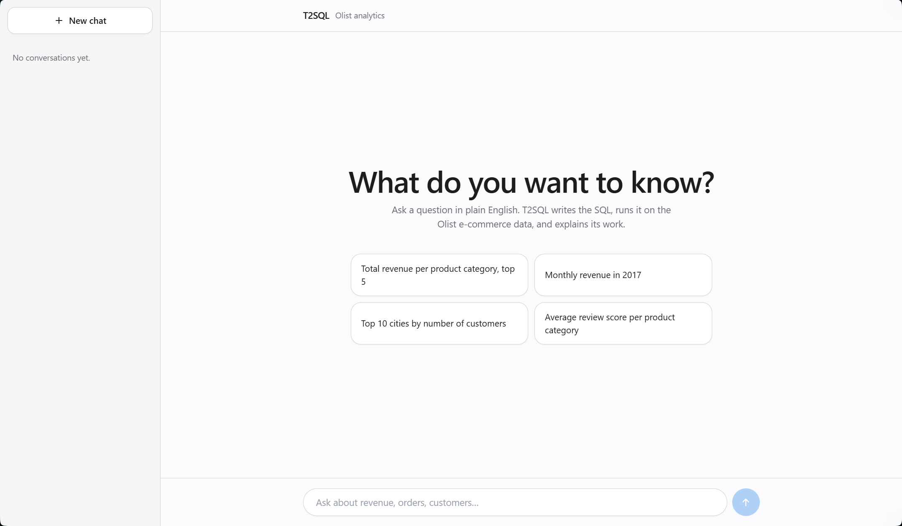
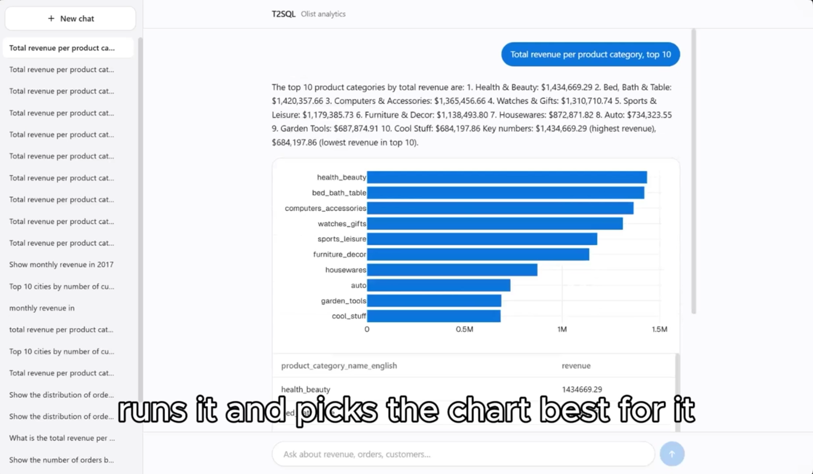
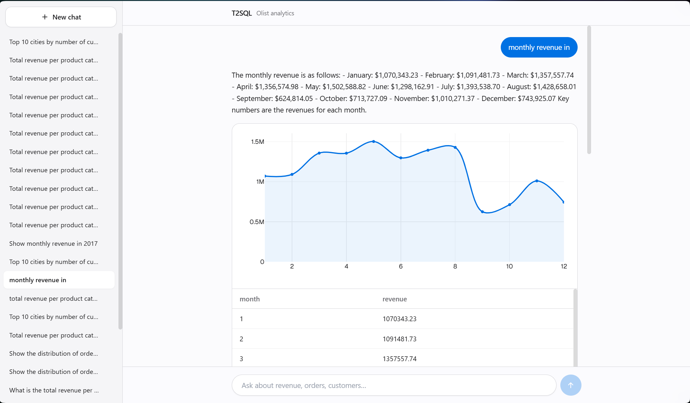
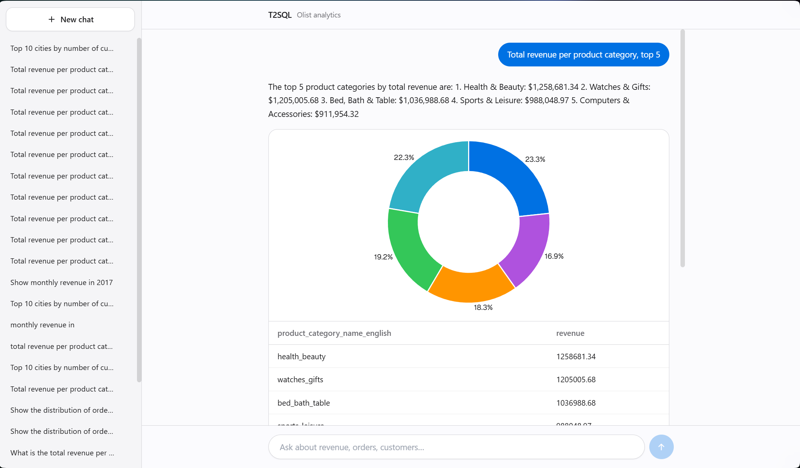
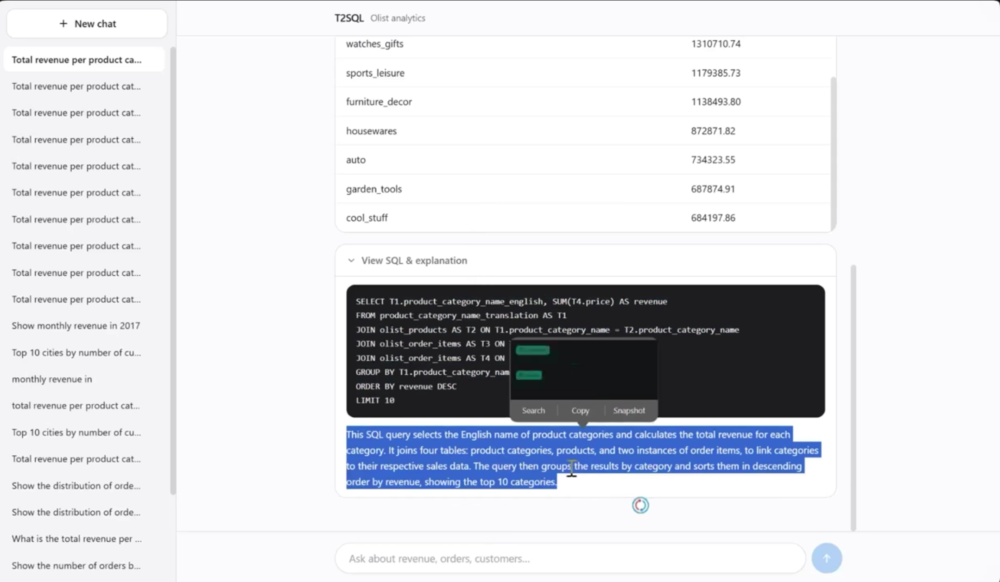

# T2SQL — Agentic Text-to-SQL Analytics & Forecasting Platform

Natural-language business questions → **agentic** SQL generation → PostgreSQL execution with
**self-correction** → natural-language answer + **dynamic tables/charts**, plus **LSTM-based
revenue forecasting**. Built on the Brazilian E-Commerce (Olist) dataset.

> Portfolio + learning project. Goals: (1) master SQL to the level an AI engineer needs,
> (2) build strong end-to-end deployment skills.



Ask in plain English. The agent writes the SQL, runs it against the Olist database, picks a
suitable visualization, and explains the query it wrote.

## How it works

A [LangGraph](https://github.com/langchain-ai/langgraph) state machine drives the whole pipeline:

```
classify_intent → fetch_schema → generate_sql → validate_sql → execute_sql
                                                        │
                                          (Postgres error) │
                                                        ▼
                                                  self_correct  (retries, capped)
                                                        │
                                          execute_sql ◄─┘
                                                        │
                                          decide_visualization → summarize
```

- **classify_intent** — decides whether the question needs SQL at all.
- **generate_sql / validate_sql** — the LLM writes SQL against the introspected schema; a
  static guard statically rejects anything that isn't a `SELECT`.
- **self_correct** — on a Postgres error, the error + failed SQL + schema are fed back to the
  LLM and retried up to `MAX_SELF_CORRECT_RETRIES` times before failing gracefully.
- **decide_visualization** — a heuristic picks table vs. bar/line/pie chart from the result shape.
- **summarize** — turns the result into a plain-English answer plus a teaching explanation of
  the generated SQL.

The whole flow streams to the client over Server-Sent Events (`POST /api/chat`), so the UI can
show each step as it happens.

### `decide_visualization` in practice

The same pipeline produces a different chart depending on the shape of the result set — the
heuristic reads the columns, not the question.

**Ranked categories → horizontal bar.** Ten labelled categories ordered by one measure, so the
bars are laid out horizontally to keep the category names readable:



| A date/period column → line | A small share breakdown → donut |
|---|---|
|  |  |
| `month` is ordinal, so the points are connected to show the trend — here the September drop and the November recovery. | Five slices of one total, so relative share is the interesting part and percentages are drawn on the segments. |

Every answer keeps the raw result table directly under the chart, so the numbers behind the
picture are always one scroll away.

### `summarize` — the SQL, explained

The learning goal is built into the product: every answer carries a collapsible **View SQL &
explanation** panel with the exact query that ran and a plain-English walkthrough of it.



Note the join path in that query — it is the one that matters most in this schema. **Revenue is
not a column**: it is `SUM(olist_order_items.price)`, reached from the category translation table
through `olist_products` and `olist_order_items`.

## Stack

| Layer | Tech |
|-------|------|
| Frontend | Next.js 14, React, TypeScript, Tailwind, shadcn/ui, Framer Motion, Plotly.js |
| Backend | FastAPI, LangGraph, LangChain, SQLAlchemy, psycopg |
| LLM | Groq (Llama 3.3 70B) primary, Gemini fallback — provider-agnostic layer |
| Database | PostgreSQL 16 (Olist dataset), read-only role for agent queries |
| ML | PyTorch (pretrained LSTM), planned for revenue forecasting |
| DevOps | Docker, Docker Compose, GitHub Actions, Railway (planned) |

## Project structure

```
T2SQL/
├── backend/
│   ├── app/
│   │   ├── agent/       # LangGraph nodes, state machine, SQL guard, viz heuristic
│   │   ├── api/          # /api/chat (SSE), /api/conversations
│   │   └── db/           # connection, schema introspection, conversation store
│   └── tests/
├── frontend/              # Next.js chat UI
├── db/init/               # Postgres init scripts (schema + Olist CSV load + read-only role)
├── models/                # Pretrained LSTM artifacts (Phase 4)
├── data/raw/               # Olist CSVs (not committed)
├── docs/sql-notes.md       # SQL learning notes
├── docs/images/            # README screenshots
└── prd.md                  # Product requirements
```

## Security invariants

- **SELECT-only**: SQL containing `INSERT/UPDATE/DELETE/DROP/ALTER/TRUNCATE/GRANT` is statically
  rejected in `validate_sql` before it ever reaches Postgres.
- The agent connects to Postgres with a **read-only role**, in addition to the static guard.
- A statement timeout (`SQL_STATEMENT_TIMEOUT_MS`) bounds every query.
- Secrets (LLM keys, DB URLs) live only in `.env` (gitignored); `.env.example` documents the shape.

## Getting started

Requires Docker Desktop, Python 3.10, and Node 18+.

```bash
# 1. Configure environment
cp .env.example .env   # fill in your LLM API key(s)

# 2. Start Postgres (loads the Olist dataset on first run)
docker compose up -d

# 3. Backend
cd backend
python -m venv .venv && source .venv/Scripts/activate   # PowerShell: .venv\Scripts\Activate.ps1
pip install -r requirements.txt
uvicorn app.main:app --reload      # http://127.0.0.1:8000 , health: /api/health

# 4. Frontend
cd ../frontend
npm install
npm run dev                         # http://localhost:3000
```

On Windows, `start.bat` / `stop.bat` in the repo root do all of the above (Postgres + backend +
frontend) in one step.

> **Why port 15432?** Postgres listens on **15432** on the host (5432 inside the container).
> On Windows, WinNAT reserves a block of ports that swallows 5432, and Docker cannot bind it
> (`bind: An attempt was made to access a socket in a way forbidden by its access permissions`).
> Check your own machine with `netsh int ipv4 show excludedportrange protocol=tcp`; if 5432 is
> free for you, set `POSTGRES_PORT=5432` in `.env` and update the two `*_DATABASE_URL` values.

### Tests

```bash
cd backend
pytest
ruff check .
```

## Status

🚧 In active development. Scope and requirements live in [`prd.md`](./prd.md).

- ✅ Phase 0 — Postgres + Olist data loaded, SQL fundamentals
- ✅ Phase 1 — LangGraph agent core: classify → generate → validate → execute → self-correct → summarize
- ✅ Phase 2 — Visualization heuristic + `/api/chat` SSE streaming
- ✅ Phase 3 — Next.js chat UI
- 🚧 Phase 4 — LSTM revenue forecasting
- ⬜ Phase 5 — Docker Compose full stack, CI/CD, Railway deploy
- ⬜ Phase 6 — Polish, rate limiting, demo
